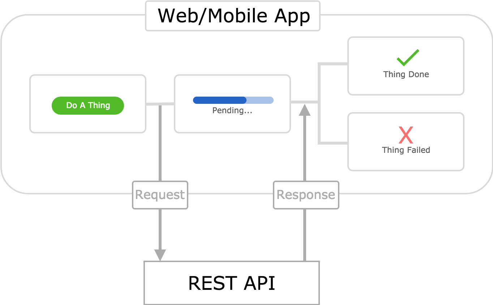
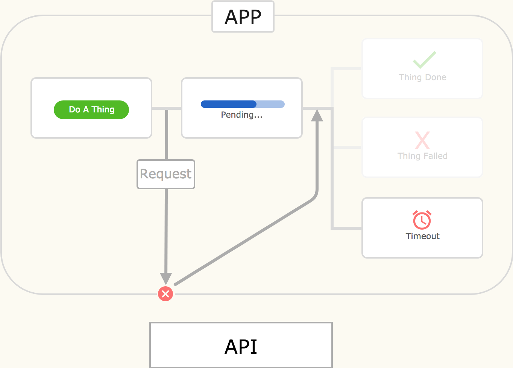
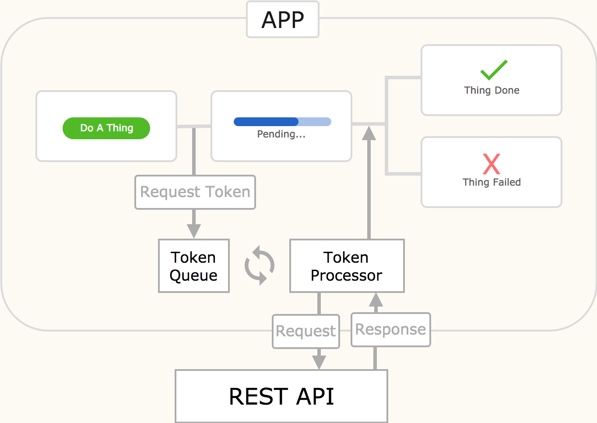
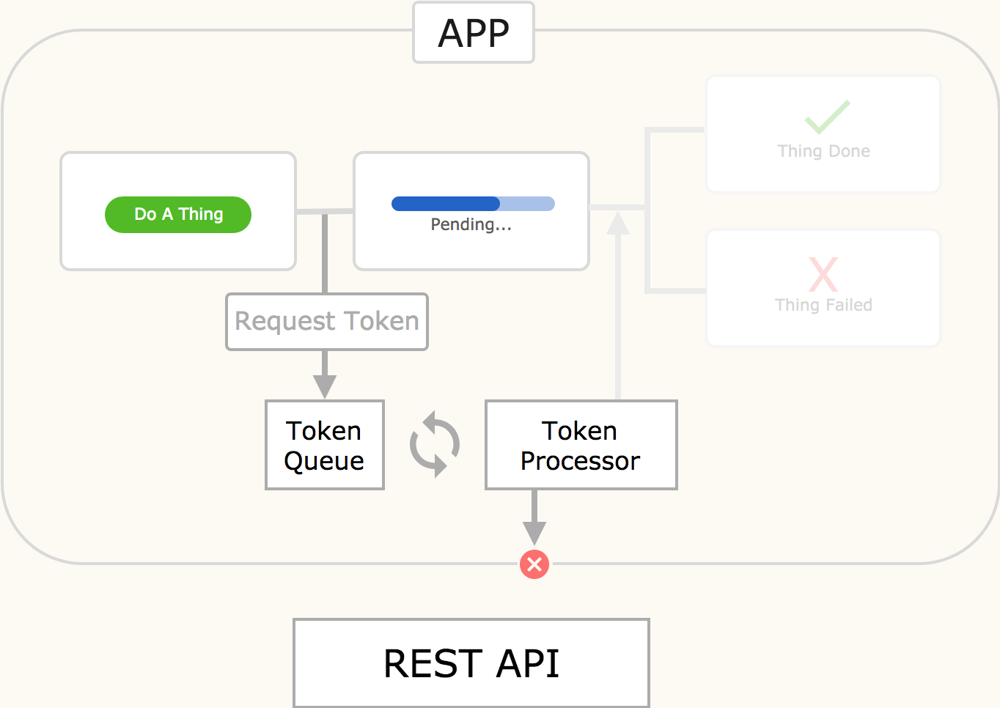
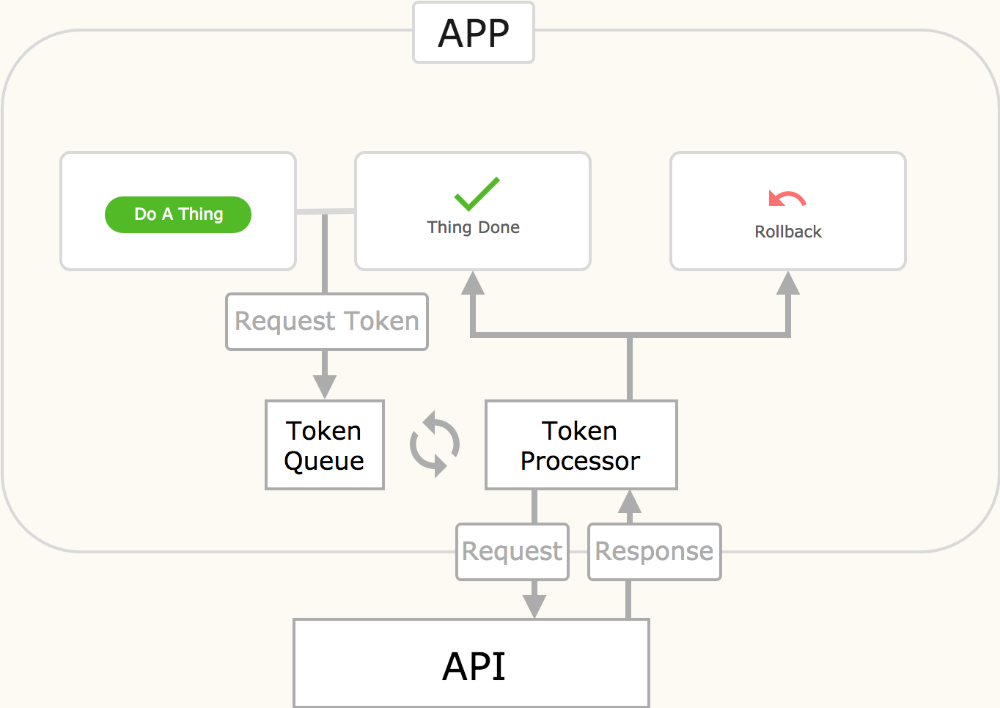
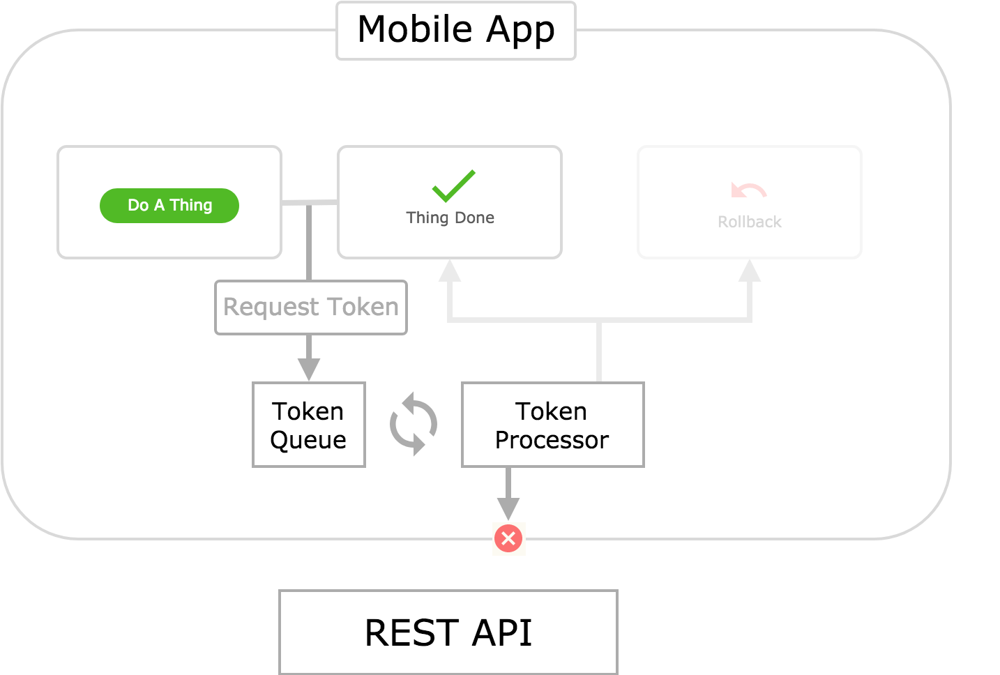
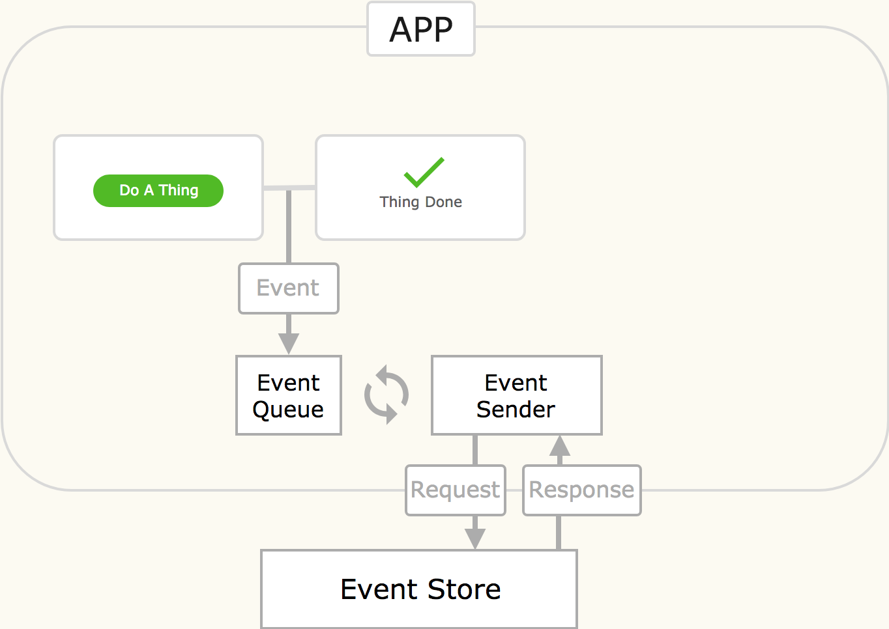
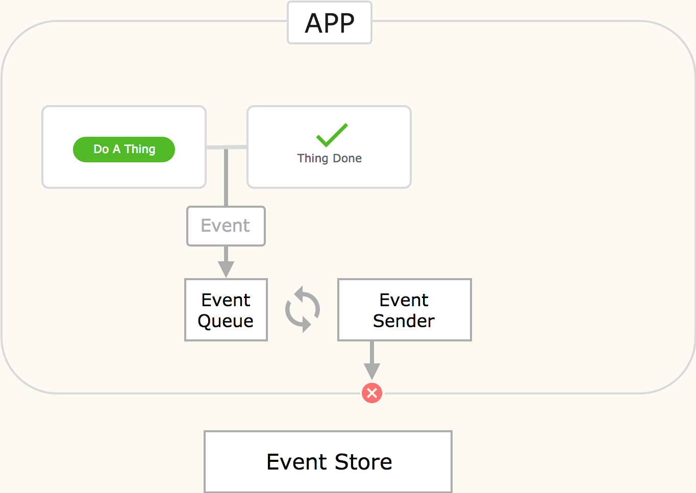

**TODO: Talk about how making an offline app that interacts with an API is more difficult than one that doesn't.**

**TODO: Update the "API" box to say "REST API" for clarity?**

## Request Driven - Traditional Online

Let's call the architecture outlined in this diagram the **Traditional Request Driven** architecture. It works by sending HTTP requests to an API in response to relevant user actions. The app then renders a pending status in the UI while it waits for an API response. When one is received, the app presents a success or failure screen to the user based on the status code of the response.

This is the most common architecture for web apps. It is very common in mobile apps as well. Let's break down why:

* **It's simple.** There aren't any fancy bells or whistles in this architecture. You just send a request, wait for a response, and then handle it. This is a simple linear flow that's easy to reason about.
* **It's easy to implement.** Many developers have experience with this architecture. If you've ever worked on a web or mobile app, then you've probably implemented a flow similar to the one depicted in this architecture. There are plenty of examples online. It doesn't require a lot of careful thought to do well.
* **It's safe and robust.** By this I mean that it is difficult for an app using this architecture to get itself into an inconsistent state. It makes no assumptions about whether the HTTP requests it generates will succeed or fail. It just waits to see what happens, and responds appropriately. If the API goes down, the app will simply indicate to the user that the action they have taken has failed.
* **It's "truthful" to the user.** The UI presented in this architecture makes it very clear to the user what is happening. Anybody who uses technology will be familiar with a pending or loading status in software. And, unfortunately, they'll also understand a failure state. The user will be annoyed if something takes a long time to process, or if it fails thereafter. But they will understand what is happening.

So it's pretty great. Awesome. But there is one _tiny_ caveat to this architecture's awesomeness: It assumes you have internet connectivity. What happens if we flip off the connectivity switch?

## Request Driven - Traditional Offline

A timeout. This is different from the request _failing_. In this scenario, the request never made it off the device. You can, of course, handle this situation and render a nice screen in your UI notifying the user of what happened. Perhaps you'll even recommend that they regain internet connectivity and try again.

Handling timeout errors is all good and well, but it doesn't change the fact that this architecture does not work when the user is offline. This isn't a big deal in many cases. Web apps in particular are usually safe assuming the user has internet connectivity - how else would they have been able to access the web app to begin with?

But if the app depicted here is a mobile app, then we might have a problem. Because mobile apps are installed on a user's device, they can be opened and used even without internet connectivity (after they've been installed).

Consider a hypothetical chat app like Facebook Messenger or Slack. If you don't have connectivity, then your messages can't be sent to their recipient. And you can't receive messages sent by them. This is a brute fact of nature. Our hypothetical app should then notify the user they are offline and that their messages cannot be sent _right now_.

But this doesn't mean that the app can't send them _later_, when the user regains connectivity. You might want to allow the user to enter a series of messages when they are offline. The app can then hold these messages in memory and send them to their recipient when connectivity is regained.
**(Note: This might be a bad example for the event driven model? Because the user should _know_ their messages haven't been sent yet.)**

This is an example of _offline tolerant functionality_ - or just _offline functionality_. As mentioned above, the Traditional Request Driven architecture does not support features like this. So then how can we go about implementing offline functionality?

There are, of course, a countless number of alternative architectures that one might concoct to handle these offline scenarios. I'd like to explore three particular architectures that have been used for mobile app projects I've been a part of. Let's call them the **Token Queue Request Driven**, **Token Queue Request Driven with Optimistic Updates**, and **Event Queue with Optimistic Updates** architectures. **(Note: Mention Stride & Flex here?)**.

## Request Driven - Token Queue Online

This architecture works by storing requests in a queue, and then sending them to the API. If the app loses connectivity, these requests are simply kept in the queue until the app comes back online - at which point they are sent off.

You might be wondering at this point "How do you store an HTTP request in a queue?" This is a good question, because you can only store _objects_ in a queue. But HTTP requests are not objects, they are _processes_. We can solve this problem by creating an object that represents an HTTP request. Let's call this object a **request token**.

So when the user performs an action in the app, a request token is generated and placed on the **token queue**. We now need a mechanism to convert these request tokens into actual HTTP requests, and handle the response. Let's call this mechanism the **token processor**.

Let's call the process of converting request tokens into successful HTTP requests **token resolution**. So we can say that the token processor tries to **resolve** request tokens. If the HTTP request comes back with a non-200 response code, we'll say that the token's resolution failed.

We can now store request tokens that are generated when a user is offline and performs an action that must be communicated the the API. When the app regains connectivity, we simply resolve any stored request tokens by converting them into HTTP requests to the API.

This is great! So we've solved the problem we encountered in the Traditional Request Driven architecture - that it doesn't work offline. Are we done now?

## Request Driven - Token Queue Offline

Well, maybe. But this new architecture has produced a new problem: the user can now get stuck in a pending state for a long period of time.

This can happen because after generating a request token, the UI moves into a pending state until that token is resolved. How long does it take for a token to be resolved? Well, if the app is online, it probably won't take but a few seconds. But if the app is offline, then it could take minutes, hours, or days - however long it takes for the user to move to an area in which the app can reestablish connectivity.

This is particularly troublesome if the user needs to perform a series of _dependent_ actions while they are offline. To make this concrete, consider the following scenario:

1.  The app is offline.
2.  The user takes an action to create some kind of record.
3.  A request token is generated that will resolve to a POST request which creates the record in the backend.
4.  The app enters a pending state - thus preventing further action on the record until the token has resolved, and the app is able to confirm the record was successfully created.
5.  The user realizes they made a mistake, and would like to update the record.

The salience of this problem should now be clear. The user cannot update the record until they regain connectivity, which could take a nontrivial amount of time. Obviously, this is terribly inconvenient to the user, and they may even forget to update the record when they are back online.

How can we solve this problem? How can we allow the user to perform a series of dependent actions that must be communicated to an API, while the user is offline?

## Request Driven - Token Queue Online (Optimistic Update)

This architecture retains the concept of a request token, as well as the token queue and token processor modules. It differs from the previous architecture in how it updates the UI after generating a request token.

The previous architecture entered a pending state and waited for resolution of the token. This architecture performs an **optimistic update**. An optimistic update simply assumes that the request token will resolve successfully, and updates the UI accordingly.

Of course, the token may _not_ resolve successfully. What then? In this case, the app will perform a **rollback**. This entails reverting the state of the app back to what it was prior to the user performing any actions for which token resolution failed.

The primary benefit to this architecture is that it immediately renders a success screen to the user. They don't have to wait at all for token resolution. This seems to solve the problem we encountered in the previous architecture - that a user cannot perform a series of dependent actions that must be communicated to the API while offline.

Pretty cool. But let's take a look at what happens in this architecture when it goes offline.

## Request Driven - Token Queue Offline (Optimistic Update)

[[

1.  Passing result context to resolution of dependent tokens
2.  Rollbacks are terrible for UX

]]

Users are able to perform actions and the UI updates immediately. The user could potentially perform a lengthy series of interdependent actions while they're offline. This is great for the user - unless a rollback becomes necessary.

Rollbacks make for a terrible UX because they are very jarring and confusing to users. It's hard to implement them elegantly in a way that makes sense. There's no easy way to tell a user "it worked!" only to later change your mind and tell them "...actually nevermind, it didn't _really_ work."

There are two factors that can magnify the annoyance caused by a rollback:

* The length of time between when a user performs an action, and when it is rolled back.
* The number of actions that must be rolled back.

Unfortunately, this architecture allows both of these factors to grow quite large in offline mode. The longer a user is offline, the larger these factors become. It would be possible a user to complete an entire workflow in offline mode, only to have the whole thing discarded by a rollback when they come back online. This would make for quite an agonizing UX.

----> Talk about why rollbacks are necessary due to multiple endpoints, and how a single endpoints avoids this problem.

## Event Sourcing

**(running assumption is that the API is a REST API)**
At this point its useful to consider why rollbacks are necessary. They are necessary because HTTP requests can fail. Most mobile apps interact with a REST API over HTTP using several different endpoints. Oftentimes, these endpoints are backed by different services and databases - each of which can fail in different ways.

Because mobile apps make so many _different_ requests, each of which can fail for _different_ reasons at _different_ times, responding to failed HTTP requests is very important.

## Event Driven - Event Queue Online (Optimistic Update)

This architecture replaces request tokens with **events**. The difference between events and request tokens is that events represent actions taken by users, whereas request tokens represent HTTP requests.

For example, if a user was to create a record, an event for that action would be produced. If the user updated a record, a different event would be produced. These events can be used to update the state of the app. They have meaning in and of themselves.

Because these events are just plain JSON objects, they can easily be transmitted over HTTP. But they have _no inherent relationship to any given HTTP request_. Again, this is a crucial distinction and is what differentiates events from request tokens. Request tokens are very tightly coupled to HTTP requests. Each request token represents a very specific HTTP request, and doesn't have meaning outside of that context.

The **event queue** in this architecture is more or less the same as the token queue in the previous architectures. The only real difference is that the event queue stores events, instead of request tokens.

The token processor in the previous architectures has a rather complicated job. It has to convert request tokens into actual HTTP requests. Each request can be sent to a different API endpoint, have a different body, header set, etc... The token processor has to handle updating the state of the app in response to token resolution. And because token resolution can also fail, the token processor has to handle rollback logic, which can get quite complicated.

The **event sender**, however, is quite a bit different from the token processor. Its job is _much_ simpler.

## Event Driven - Event Queue Offline (Optimistic Update)

