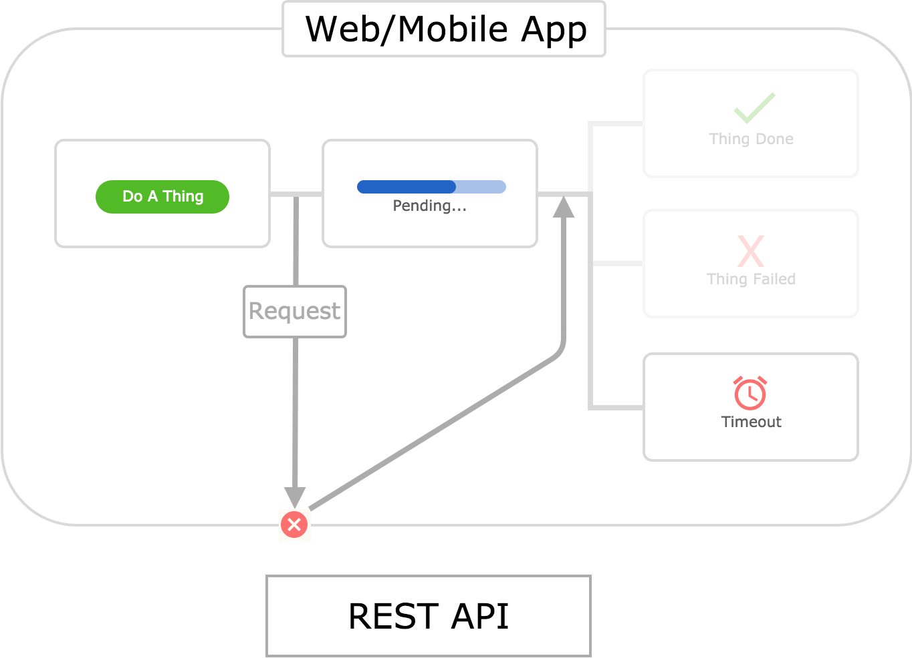
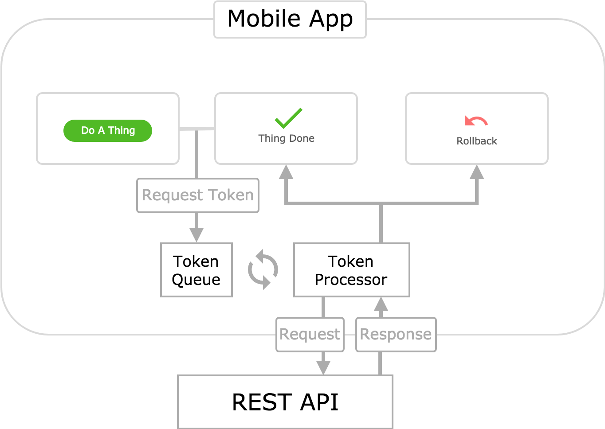

**TODO: Talk about how making an offline app that interacts with an API is more difficult than one that doesn't.**

## Request Driven - Traditional Online

Let's call the architecture outlined in this diagram the _Traditional Request Driven_ architecture. It works by sending HTTP requests to an API in response to relevant user actions. The app then renders a pending status in the UI while it waits for an API response. When one is received, the app presents a success or failure screen to the user based on the status code of the response.

This is the most common architecture for web apps. It is very common in mobile apps as well. Let's break down why:

* **It's simple.** There aren't any fancy bells or whistles in this architecture. You just send a request, wait for a response, and then handle it. This is a simple linear flow that's easy to reason about.
* **It's easy to implement.** Many developers have experience with this architecture. If you've ever worked on a web or mobile app, then you've probably implemented a flow similar to the one depicted in this architecture. There are plenty of examples online. It doesn't require a lot of careful thought to do well.
* **It's safe and robust.** By this I mean that it is difficult for an app using this architecture to get itself into an inconsistent state. It makes no assumptions about whether the HTTP requests it generates will succeed or fail. It just waits to see what happens, and responds appropriately. If the API goes down, the app will simply indicate to the user that the action they have taken has failed.
* **It's "truthful" to the user.** The UI presented in this architecture makes it very clear to the user what is happening. Anybody who uses technology will be familiar with a pending or loading status in software. And, unfortunately, they'll also understand a failure state. The user will be annoyed if something takes a long time to process, or if it fails thereafter. But they will understand what is happening.

So it's pretty great. Awesome. But there is one _tiny_ caveat to this architecture's awesomeness: It assumes you have internet connectivity. What happens if we flip off the connectivity switch?

## Request Driven - Traditional Offline

A timeout. This is different from the request _failing_. In this scenario, the request never made it off the device. You can, of course, handle this situation and render a nice screen in your UI notifying the user of what happened. Perhaps you'll even recommend that they regain internet connectivity and try again.

Handling timeout errors is all good and well, but it doesn't change the fact that this architecture does not work when the user if offline. This isn't a big deal in many cases. Web apps in particular are usually safe assuming the user has internet connectivity - how else would they have been able to access the web app to begin with?

But if the app depicted here is a mobile app, then we might have a problem. Because mobile apps are installed on a user's device, they can be opened and used even without internet connectivity (after they've been installed).

Consider chat apps like Facebook Messenger or Slack. If you don't have connectivity, then your messages can't be sent to their recipient. And you can't receive messages sent by them. This is a brute fact of nature. The app should then notify the user they are offline and that their messages cannot be sent _right now_.

But this doesn't mean that the app can't send them _later_, when the user regains connectivity. You might want to allow the user to enter a series of messages when they are offline. The app can then hold these messages in memory and send them to their recipient when connectivity is regained.
**(Note: This might be a bad example for the event driven model? Because the user should _know_ their messages haven't been sent yet.)**

This is an example of _offline tolerant functionality_ - or just _offline functionality_. As mentioned above, the Traditional Request Driven architecture does not support features like this. So then how can we go about implementing offline functionality?

There are, of course, a countless number of alternative architectures that one might concoct to handle these offline scenarios. I'd like to explore three particular architectures that have been used for mobile app projects I've been a part of. Let's call them the _Token Queue Request Driven_, _Token Queue Request Driven with Optimistic Updates_, and _Event Queue with Optimistic Updates_ architectures. **(Note: Mention Stride & Flex here?)**.

## Request Driven - Token Queue Online

// Need to store something and process them when come online. A queue is a natural data structure for handling this...

## Request Driven - Token Queue Offline

## Request Driven - Token Queue Online (Optimistic Update)

## Request Driven - Token Queue Offline (Optimistic Update)

## Event Driven - Event Queue Online (Optimistic Update)

## Event Driven - Event Queue Offline (Optimistic Update)

