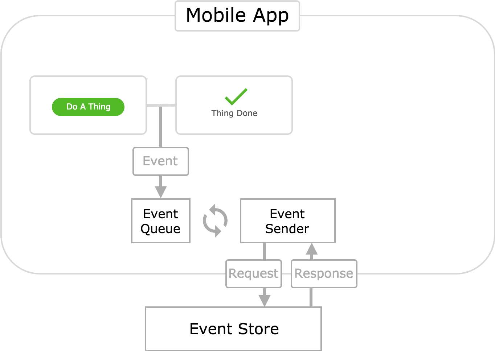
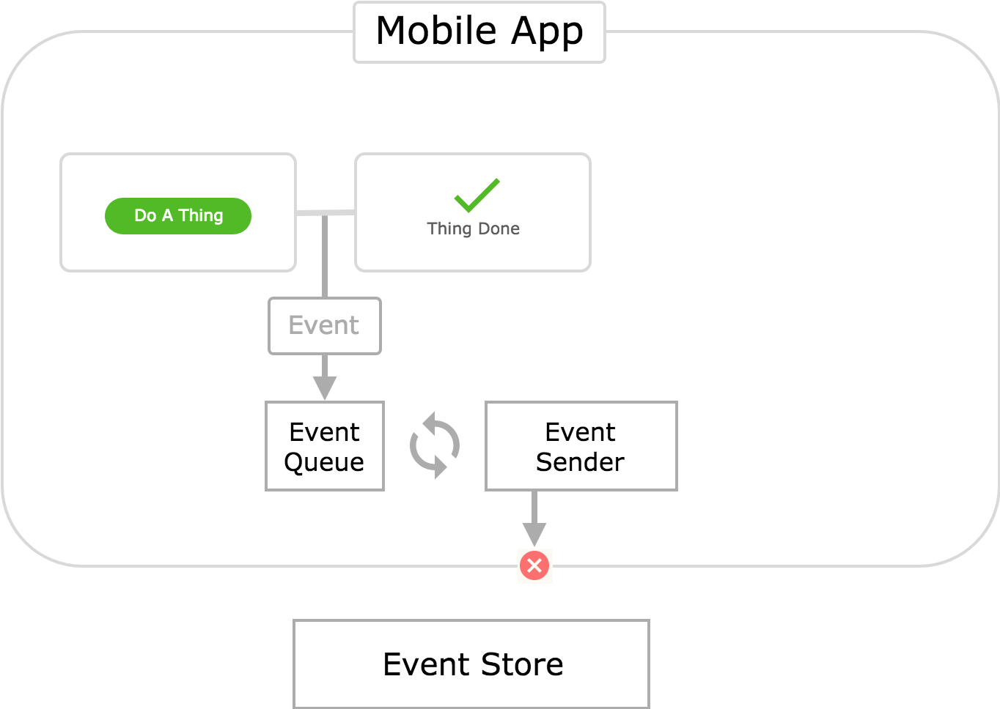

At [QDivision](https://qdivision.io/), where I work, we've been building a number of mobile apps recently. A core requirement of many of these apps is that they allow the user to complete their work offline. You might not think that it would be difficult to create an app that works offline. Making a calculator or note-taking app isn't hard, unless you're also required to store those calculations and notes in the cloud to be shared and interact with other systems and users when the app comes online.

These are relatively trivial examples, but it's easy to see how creating an app that works offline, and is capable of sharing data when online, becomes more difficult as its feature count increases.

I've worked on a couple of these mobile apps and helped develop a number of different solutions to address these problems. I'll discuss these architectures below. The first two architectures are designed to work on top of REST backend services. The third architecture is a more novel design that requires a different kind of data model and backend architecture.

(For the most part, these architectures were implemented in JavaScript, React, and Redux apps. However, please note that I will discuss these architectures at a high level. I will try not to get into specific technologies or implementation details in this post - though some may still leak through.)

## Traditional Request Driven - Online


Let's call the architecture outlined in this diagram the **Traditional Request Driven** architecture. It works by sending HTTP requests to an API in response to relevant user actions. The app then renders a pending status in the UI while it waits for an API response. When one is received, the app presents a success or failure screen to the user based on the status code of the response.

This is the most common architecture for web apps. It is very common in mobile apps as well. Let's break down why:

* **It's simple.** There aren't any fancy bells or whistles in this architecture. You just send a request, wait for a response, and then handle it. This is a simple linear flow that's easy to reason about.
* **It's easy to implement.** Many developers have experience with this architecture. If you've ever worked on a web or mobile app, then you've probably implemented a flow similar to the one depicted in this architecture. There are plenty of examples online. It doesn't require a lot of careful thought to do well.
* **It's safe and robust.** By this I mean that it is difficult for an app using this architecture to get itself into an inconsistent state. It makes no assumptions about whether the HTTP requests it generates will succeed or fail. It just waits to see what happens, and responds appropriately. If the API goes down, the app will simply indicate to the user that the action they have taken has failed.
* **It's "truthful" to the user.** The UI presented in this architecture makes it very clear to the user what is happening. Anybody who uses technology will be familiar with a pending or loading status in software. And, unfortunately, they'll also understand a failure state. The user will be annoyed if something takes a long time to process, or if it fails thereafter. But they will understand what is happening.

So it's pretty great. Awesome. But there is one _tiny_ caveat to this architecture's awesomeness: It assumes you have internet connectivity. What happens if we flip off the connectivity switch?

## Traditional Request Driven - Offline


A timeout. This is different from the request _failing_. In this scenario, the request never made it off the device. You can, of course, handle this situation and render a nice screen in your UI notifying the user of what happened. Perhaps you'll even recommend that they regain internet connectivity and try again.

Handling timeout errors is all good and well, but it doesn't change the fact that this architecture does not work when the user is offline. This isn't a big deal in many cases. Web apps in particular are usually safe assuming the user has internet connectivity - how else would they have been able to access the web app to begin with?

But if the app depicted here is a mobile app, then we might have a problem. Because mobile apps are installed on a user's device, they can be opened and used even without internet connectivity (after they've been installed).

Consider a hypothetical chat app like Facebook Messenger or Slack. If you don't have connectivity, then your messages can't be sent to their recipient. And you can't receive messages sent by them. This is a brute fact of nature. Our hypothetical app should then notify the user they are offline and that their messages cannot be sent _right now_.

But this doesn't mean that the app can't send them _later_, when the user regains connectivity. You might want to allow the user to enter a series of messages when they are offline. The app can then hold these messages in memory and send them to their recipient when connectivity is regained.

This is an example of **offline tolerant functionality** - or just **offline functionality**. As mentioned above, the Traditional Request Driven architecture does not support features like this. So then how can we go about implementing offline functionality?

There are, of course, a countless number of alternative architectures that one might concoct to handle these offline scenarios. I'd like to explore three particular architectures that have been used for mobile app projects I've been a part of. Let's call them the

* **Request Token Queue** architecture
* **Request Token Queue with Optimistic Updates** architecture, and
* **Event Queue with Optimistic Updates** architecture

## Request Token Queue - Online


This architecture works by storing requests in a queue contained in the mobile app, and then sending them to the API. If the app loses connectivity, these requests are simply kept in the queue until the app comes back online - at which point they are sent off.

You might be wondering at this point "How do you store an HTTP request in a queue?" This is a good question, because you can only store _objects_ in a queue. But HTTP requests are not objects, they are _processes_. We can solve this problem by creating an object that represents an HTTP request. Let's call this object a **request token**.

So when the user performs an action in the app, a request token is generated and placed on the **token queue**. We now need a mechanism to convert these request tokens into actual HTTP requests, and handle the response. Let's call this mechanism the **token processor**.

Let's call the process of converting request tokens into successful HTTP requests **token resolution**. So we can say that the token processor tries to **resolve** request tokens. If the HTTP request comes back with a non-200 response code, we'll say that the token's resolution failed.

We can now store request tokens that are generated when a user is offline and performs an action that must be communicated the the API. When the app regains connectivity, we simply resolve any stored request tokens by converting them into HTTP requests to the API.

This is great! So we've solved the problem we encountered in the Traditional Request Driven architecture - that it doesn't work offline. Are we done now?

## Request Token Queue - Offline


Maybe. But this new architecture has introduced a new problem: the user can now get stuck in a pending state for a long period of time.

This can happen because after generating a request token, the UI moves into a pending state until that token is resolved. How long does it take for a token to be resolved? If the app is online, it probably won't take but a few seconds. But if the app is offline, then it could take minutes, hours, or days - however long it takes for the user to move to an area in which the app can re-establish connectivity.

This is particularly troublesome if the user needs to perform a series of _dependent_ actions while they are offline. To make this problem concrete, consider the following scenario:

1.  The app is offline.
2.  The user takes an action to create some kind of record.
3.  A request token is generated that will resolve to a POST request which creates the record in the backend.
4.  The app enters a pending state - thus preventing further action on the record until the token has resolved, and the app is able to confirm the record was successfully created.
5.  The user realizes they made a mistake, and would like to update the record.

The salience of this problem should now be clear. The user cannot update the record until they regain connectivity, which could take a nontrivial amount of time. Obviously, this is terribly inconvenient to the user, and they may even forget to update the record when they are back online.

How can we solve this problem? How can we allow the user to perform a series of dependent actions that must be communicated to an API, while the user is offline?

## Request Token Queue with Optimistic Updates - Online


This architecture retains the concept of a request token, as well as the token queue and token processor modules. It differs from the previous architecture in how it updates the UI after generating a request token.

The previous architecture entered a pending state and waited for resolution of the token. This architecture performs an **optimistic update**. It simply assumes that the request token will resolve successfully, and updates the UI accordingly.

Of course, the token may _not_ resolve successfully. What then? In this case, the app will perform a **rollback**. This entails reverting the state of the app back to what it was prior to the user performing any actions for which token resolution failed.

The primary benefit to this architecture is that it immediately renders a success screen to the user. They don't have to wait at all for token resolution. This seems to solve the problem we encountered in the previous architecture - that a user cannot perform a series of dependent actions that must be communicated to the API while offline.

Pretty cool. But let's take a closer look at what happens in this architecture when it goes offline.

## Request Token Queue with Optimistic Updates - Offline


Users are able to perform actions and the UI updates immediately. The user could potentially perform a lengthy series of interdependent actions while they're offline. This is great for the user - unless a rollback becomes necessary.

Rollbacks make for a terrible UX because they are very jarring and confusing to users. It's hard to implement them elegantly in a way that makes sense. There's no easy way to tell a user "it worked!" only to later change your mind and tell them "...actually nevermind, it didn't _really_ work."

There are two factors that can magnify the annoyance caused by a rollback:

* The length of time between when a user performs an action, and when it is rolled back.
* The number of actions that must be rolled back.

Unfortunately, this architecture allows both of these factors to grow quite large in offline mode. The longer a user is offline, the larger these factors become. It would be possible for a user to complete an entire workflow in offline mode, only to have the whole thing discarded by a rollback when they come back online. This would make for quite an agonizing UX.

### Avoiding Rollbacks with Event Sourcing

At this point it's useful to consider why rollbacks are necessary. They are necessary because HTTP requests can fail. Most mobile apps interact with a REST API over HTTP using several different endpoints. Oftentimes, these endpoints are backed by different services and databases - each of which can fail in different ways.

Because mobile apps make so many _different_ requests, each of which can fail for _different_ reasons at _different_ times, responding to failed HTTP requests is very important. Of course, in this architecture, we respond to these request failures with rollbacks.

What if we make a more foundational change to how we approach state management and interaction with backend services? Can we avoid some of these issues, and create an architecture with all of the advantages of optimistic updates, but in which rollbacks are not necessary?

In fact, we can! We can convert our system from a traditional REST architecture to an event sourced one. **Event sourcing** is a system architecture in which objects called events are the source of truth. In an event sourcing system, state is not stored as a structured object in a SQL database. Instead, state is recorded as a series of events - an array of event objects. This series of events can then be run through an interpreter that converts an event stream into an actual state object.

Event sourcing deserves a blog post in and of itself (or several). It's a fascinating architecture that solves a lot of common problems with REST, and introduces other new ones. I've only given a brief description of the subject - just enough to understand the offline architecture I'll introduce below. You can read more about event sourcing [here](https://martinfowler.com/eaaDev/EventSourcing.html).

## Event Queue with Optimistic Updates - Online



This architecture replaces request tokens with **events**. The difference between events and request tokens is that events represent actions taken by users, whereas request tokens represent HTTP requests.

For example, if a user was to create a record, an event for that action would be produced. If the user updated a record, a different event would be produced. These events can be used to update the state of the app. They have meaning in and of themselves.

Because these events are just plain JSON objects, they can easily be transmitted over HTTP.

These event objects can be transmitted over HTTP, but they have _no inherent relationship to any given HTTP request_. This is a crucial distinction that differentiates events from request tokens. Request tokens are very tightly coupled to HTTP requests. Each request token represents a very specific HTTP request, and doesn't have meaning outside of that context.

The **event queue** in this architecture is more or less the same as the token queue in the previous architectures. The only real difference is that the event queue stores events, instead of request tokens.

The token processor in the previous architectures has a rather complicated job. It has to convert request tokens into actual HTTP requests. Each request can be sent to a different API endpoint, have a different body, header set, etc. The token processor has to handle updating the state of the app in response to token resolution. And because token resolution can also fail, the token processor has to handle rollback logic, which can get quite complicated.

The **event sender**, however, is _much_ simpler. Its only job is to send events from the event queue to the **event store** via HTTP requests. This consists of sending arrays of events to endpoints of the event store's API via POST requests. (The number of endpoints involved is usually very small. Depending on the domain and how you choose to organize your events, it may even be a single endpoint!)

Let's investigate what happens when this architecture goes offline.

## Event Queue with Optimistic Updates - Offline



The user can perform an arbitrary series of actions without ever encountering a loading screen. Each action will produce an event object. This event object is used to update the app's state, and is then sent into the event queue.

Because the user is offline, the event sender is unable to send the events in the queue to the event store. But that's okay, because when the user comes back online, the events will be sent to the event store in a small number of efficient POST requests. It's not necessary to create a dedicated POST request for each event. (The events can be grouped by their respective domains, or depending on your implementation, you may have a single group for all events).

The app will also need to obtain any new events that have been sent to the store from other sources to stay up-to-date. This can be done in different ways, depending on how you choose to implement event sourcing. One approach would be to make a GET request for new events before sending those queued by the app while offline. Another way is to just send the POST request, and let the event store merge the queued actions appropriately. The event store can then send back the last _n_ events of the stream in the POST request's response body (where _n_ consists of any new events in the store merged with the POSTed actions). With either approach, the app will need to take the events obtained from the store and run them through the interpreter to update its state.

No rollback logic is required because the likelihood of failure is incredibly low in this model, compared to a typical REST approach. If the event store's single endpoint ever fails to accept requests, then the app will simply hold its events in storage until the event store is fixed and able to accept the events once again.

This all happens seamlessly for the user. It really doesn't matter to them whether they are online or not. It all works the same. (Of course, they cannot receive updates from the event store when the app is offline, but this is unavoidable no matter what architecture you use).

### A Note on Determinism in Event Sourcing

You may take issue with my assertion that "No rollback logic is required" in this event sourcing architecture. In general, this is true because event sourced systems are additive. The handling of an event should be deterministic, regardless of the previous events in the stream.

For example, consider the case of a DELETE event being added to the stream, followed by an UPDATE event. Both of these events were performed on the same record. Perhaps by different users without internet connectivity, preventing them from staying in sync.

An interpreter for these events could process this stream as follows:

1.  **DELETE:** Flag the record as deleted. Don't actually remove the record.
2.  **UPDATE:** Perform the relevant updated to the record, which has been flagged as deleted.

This handling of the event stream avoids any special rollback logic. Events can always be added to the stream, and processed successfully. The processing of an event cannot "fail".

It's worth noting that this does depend on a huge number of variables. I am positive that there are situations and domains with constraints that would require some type of special rollback logic. But for many domains, the event sender can remain simple, and not require special rollback logic.

## Summary

So which architecture should you use for implementing offline functionality in a mobile app? Not surprisingly, it depends on a lot of things. However, we can consider three primary factors that might drive your decision:

* **Is it okay to present a pending screen to the user until they come online?** If so, then the Request Token Queue is a viable option. It's very similar to the Traditional Request Driven architecture, so you can bring a lot of your existing experience and intuition to bear when implementing it.
* **Does the user need to perform a series of dependent actions while offline?** If this is a requirement, then showing the user a pending screen isn't an option. So, the Request Token Queue with Optimistic Updates architecture is a valid candidate. Of course, this architecture comes with a lot of additional complexity and forces you to handle rollback logic. All of the problems that come with this architecture can make it a less than desirable solution.
* **Are you working with existing REST based services?** This matters a lot. If you are, then whatever offline architecture you choose must work on top of a REST API model. This means that the event driven architecture isn't an option, and you'll have to choose a request driven model. But if you are able to create new services based on event sourcing, then you should strongly consider the Event Queue with Optimistic Updates architecture. It avoids much of the complexity of rollbacks while still retaining the benefits of optimistic updates when offline.

## Implementation Details

Having explained these architectures in the abstract, I'd like to briefly mention how we actually implemented them for our apps at QDivision.

For one of our first apps, Stride, we used the **Request Token Queue** architecture both with and without optimistic updates. We chose these architectures because Stride needed to leverage existing REST-based services. Stride is written in [React Native](https://facebook.github.io/react-native/), and uses [Redux](https://github.com/reduxjs/redux) for state management. The [`redux-thunk`](https://github.com/reduxjs/redux-thunk) middleware is also heavily used in Stride for asynchronous processes that manipulate state - network requests, in particular. For this reason, we used **thunk tokens** instead of _request_ tokens. But the underlying concept is the same. The primary difference is that thunk tokens allowed us to move the state update logic that would normally reside in the token processor into thunks.

The thunk tokens themselves are simple JavaScript objects that can be serialized as JSON and stored in [`AsyncStorage`](https://facebook.github.io/react-native/docs/asyncstorage.html). This allows us to persist the tokens even if the app is closed. Then when it is reopened, we can proceed to resolve the tokens. It's worth noting that when implementing our offline functionality we considered using the [`react-native-offline`](https://github.com/rgommezz/react-native-offline) module, as it offers an [offline queue](https://github.com/rgommezz/react-native-offline#offline-queue) that can store thunks. However, it does not represent the thunks with token objects. It stores the actual thunk function in the queue, which means it is not capable of serializing the thunks in the queue. As such, it must keep the queue in-memory, so its contents would be lost if the app was closed out.

Flex is another app we recently launched. Flex was built from the ground up, and was independent of existing services. This meant we could implement event sourced backend services, and use the **Event Queue** architecture for the mobile app. We use Redux for state management in Flex as well. If you are familiar with Redux, you will know that it uses objects called [actions](https://redux.js.org/basics/actions) to update the app's state. This sounds a lot like event sourcing! We decided to make our events simply be our Redux actions. So we just store redux actions in a queue in the app, and send them to our event store (written in [Node JS](https://nodejs.org/en/)). Our event store uses a single PostgreSQL database table to store the events. Since our events are simply [FSA](https://github.com/redux-utilities/flux-standard-action) objects, we use the following schema for our table:

```javascript
CREATE TABLE IF NOT EXISTS actions (
  id      SERIAL  NOT NULL PRIMARY KEY,
  type    varchar NOT NULL,
  meta    jsonb   NOT NULL,
  payload jsonb   NOT NULL
);
```
