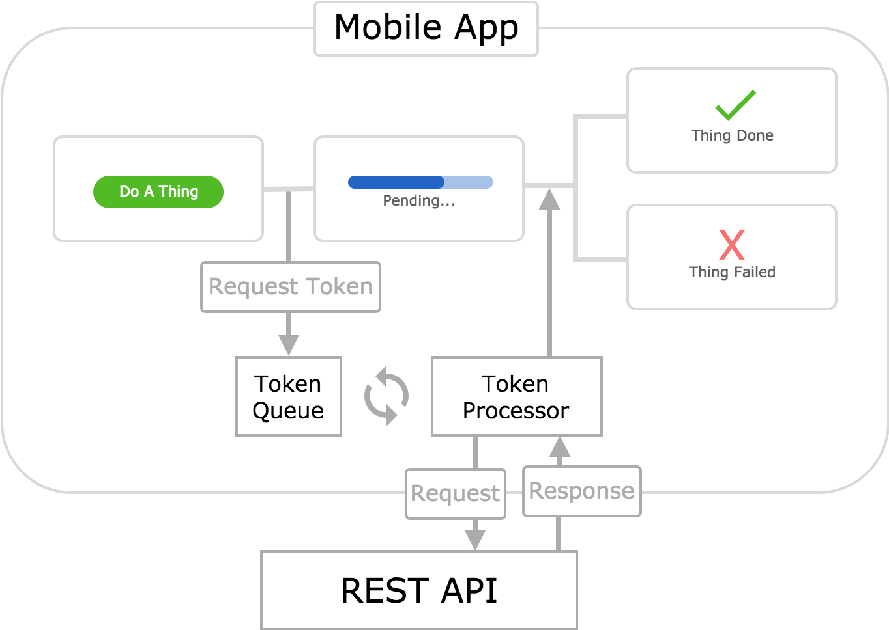
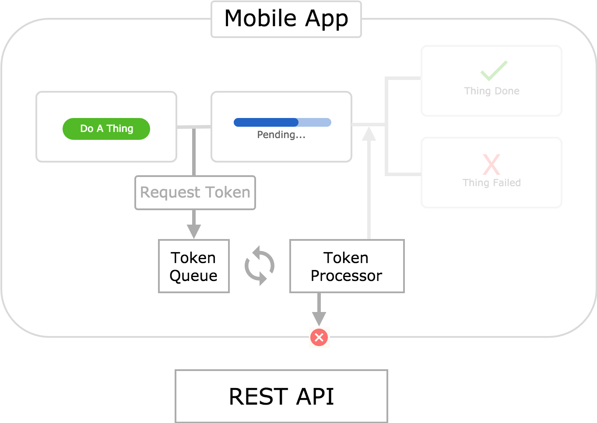

## Request Driven - Traditional Online

This is the most common architecture for web apps. It is very common in mobile apps as well. This is not surprising - let's break down why:

* **It's simple.**
* **It's easy to implement.**
* **It's safe and robust.**
* **It's "truthful" to the user.**

## Request Driven - Traditional Offline

## Request Driven - Token Queue Online

## Request Driven - Token Queue Offline

## Request Driven - Token Queue Online (Optimistic Update)

## Request Driven - Token Queue Offline (Optimistic Update)

## Event Driven - Event Queue Online (Optimistic Update)

## Event Driven - Event Queue Offline (Optimistic Update)

